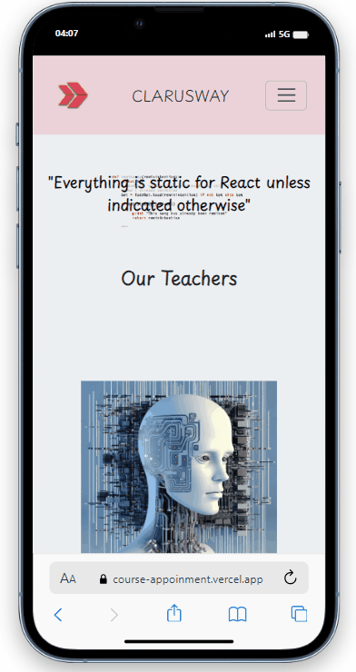

 Appointment Scheduler https://course-appoinment.vercel.app/
 Appointment Scheduler is a web application designed for scheduling appointments with teachers. It allows students to view teacher profiles, select a teacher, and book appointments based on available dates and times.

Features
Display of teacher profiles with images and department information.
Modal-based appointment scheduling system.
Search functionality to filter and find specific teachers.
A dynamic appointment list showing all scheduled appointments with options to delete or mark them as consulted.
An alert system to welcome users and provide necessary information.
Responsive design for an optimal experience on various devices and screen sizes.

Installation
To run this project on your local machine:

Clone or download the repository to your computer.
Open the project directory in your terminal.
Install the necessary dependencies (if any) via npm install or yarn.
Start the application by running npm start or yarn start.
Open your web browser and navigate to localhost:3000 (or the port provided in your terminal).

Usage
Browse through the list of available teachers on the main page.
Use the search bar to find teachers by name.
Click on a teacher's image to open the appointment modal.
Fill in the appointment details including student name, date, and time, and save the appointment.
View all scheduled appointments and manage them through the appointment list.
Click the 'Temizle' button to clear all appointments.

----Technical Details
The application is built using React.js.
State management in React for handling user inputs and appointment data.
Bootstrap is used for responsive design and UI components.
SweetAlert2 for user alerts and confirmations.

-----Dependencies-----
React.js
Bootstrap
SweetAlert2
Contributing
Contributions to this project are welcome. Please ensure to follow the existing code structure and style guides when making contributions.

# Getting Started with Create React App

This project was bootstrapped with [Create React App](https://github.com/facebook/create-react-app).

## Available Scripts

In the project directory, you can run:

### `yarn start`

Runs the app in the development mode.\
Open [http://localhost:3000](http://localhost:3000) to view it in your browser.

The page will reload when you make changes.\
You may also see any lint errors in the console.

### `yarn test`

Launches the test runner in the interactive watch mode.\
See the section about [running tests](https://facebook.github.io/create-react-app/docs/running-tests) for more information.

### `yarn build`

Builds the app for production to the `build` folder.\
It correctly bundles React in production mode and optimizes the build for the best performance.

The build is minified and the filenames include the hashes.\
Your app is ready to be deployed!

See the section about [deployment](https://facebook.github.io/create-react-app/docs/deployment) for more information.

### `yarn eject`

**Note: this is a one-way operation. Once you `eject`, you can't go back!**

If you aren't satisfied with the build tool and configuration choices, you can `eject` at any time. This command will remove the single build dependency from your project.

Instead, it will copy all the configuration files and the transitive dependencies (webpack, Babel, ESLint, etc) right into your project so you have full control over them. All of the commands except `eject` will still work, but they will point to the copied scripts so you can tweak them. At this point you're on your own.

You don't have to ever use `eject`. The curated feature set is suitable for small and middle deployments, and you shouldn't feel obligated to use this feature. However we understand that this tool wouldn't be useful if you couldn't customize it when you are ready for it.

## Learn More

You can learn more in the [Create React App documentation](https://facebook.github.io/create-react-app/docs/getting-started).

To learn React, check out the [React documentation](https://reactjs.org/).

### Code Splitting

This section has moved here: [https://facebook.github.io/create-react-app/docs/code-splitting](https://facebook.github.io/create-react-app/docs/code-splitting)

### Analyzing the Bundle Size

This section has moved here: [https://facebook.github.io/create-react-app/docs/analyzing-the-bundle-size](https://facebook.github.io/create-react-app/docs/analyzing-the-bundle-size)

### Making a Progressive Web App

This section has moved here: [https://facebook.github.io/create-react-app/docs/making-a-progressive-web-app](https://facebook.github.io/create-react-app/docs/making-a-progressive-web-app)

### Advanced Configuration

This section has moved here: [https://facebook.github.io/create-react-app/docs/advanced-configuration](https://facebook.github.io/create-react-app/docs/advanced-configuration)

### Deployment

This section has moved here: [https://facebook.github.io/create-react-app/docs/deployment](https://facebook.github.io/create-react-app/docs/deployment)

### `yarn build` fails to minify

This section has moved here: [https://facebook.github.io/create-react-app/docs/troubleshooting#npm-run-build-fails-to-minify](https://facebook.github.io/create-react-app/docs/troubleshooting#npm-run-build-fails-to-minify)
